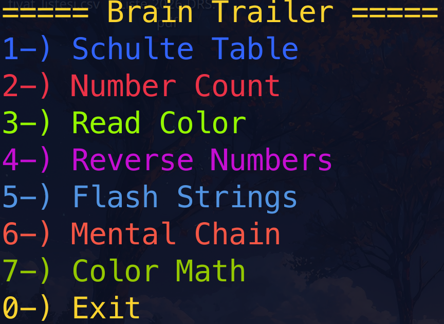

<div align="center">

# 🧠 Brain Trailer

**Improve your focus and reflexes instantly via terminal!**

[](LICENSE)
[](https://www.ruby-lang.org/en/)
[]()

<br>



</div>

---

## 📖 About

**Brain Trailer** is a minimalist, terminal-based focus development tool designed to avoid the clutter of graphical interfaces. Built with Ruby, it aims to keep cognitive activity alive with quick exercises during daily work breaks.

## ✨ Features & Modes

The application includes 7 different cognitive exercises:

1.  **Schulte Table:** Improve visual attention and peripheral vision by finding randomly placed numbers from 1 to 25 in order.
2.  **Number Count:** Test your focus speed by finding and counting a specific target number among random digits.
3.  **Read Color (Stroop Test):** Challenge your cognitive flexibility by saying the **color** of the word, not the word itself (e.g., if the word <span style="color:blue">RED</span> is written in blue, you must think "Blue").
4.  **Reverse Numbers:** Test your short-term memory by memorizing a sequence of random numbers and entering them in reverse order.
5.  **Flash Strings:** Improve your instant perception and iconic memory by recalling a random string displayed for a split second.
6.  **Mental Chain:** Strengthen sustained attention by tracking and calculating a sequence of arithmetic operations mentally without seeing the previous numbers.
7.  **Color Math:** A complex test of inhibitory control. Memorize color-operation pairs, then solve equations where the **color** of the operator determines the math, while ignoring the misleading symbol displayed.

## 📂 Project Structure

```text
Brain-Trailer/
├── main.rb          # Game engine and algorithms
├── Screen.png       # Screenshot
├── LICENSE          # License file
└── README.md        # Documentation
```

## 🚀 Installation

**Ruby** is required to run this project on your machine.

### Step-by-Step Guide

1.  **Clone the repository and enter the directory:**
    ```bash
    git clone [https://github.com/55gokmenTR/Brain-Trailer](https://github.com/55gokmenTR/Brain-Trailer)
    cd Brain-Trailer
    ```

2.  **Install the required gem:**
    The `colorize` library is required for colored terminal outputs.
    ```bash
    gem install colorize
    ```

3.  **Grant execution permission:**
    ```bash
    chmod +x main.rb
    ```

4.  **Link for system-wide access (Optional):**
    This allows you to launch the game by typing `brain` from anywhere in the terminal.
    ```bash
    sudo ln -s "$(pwd)/main.rb" /usr/local/bin/brain
    ```

## 💻 Usage

After installation, simply type the following command in your terminal:

```bash
brain
```

*Select the game mode (1-7) from the menu and press `Enter`. To exit, select 0.*

## 🤝 Contributing

To report bugs or add new game modes:
1.  Fork this repository.
2.  Create a new feature branch.
3.  Commit your changes and open a Pull Request.

## 📝 License

This project is licensed under the [MIT](LICENSE) License.